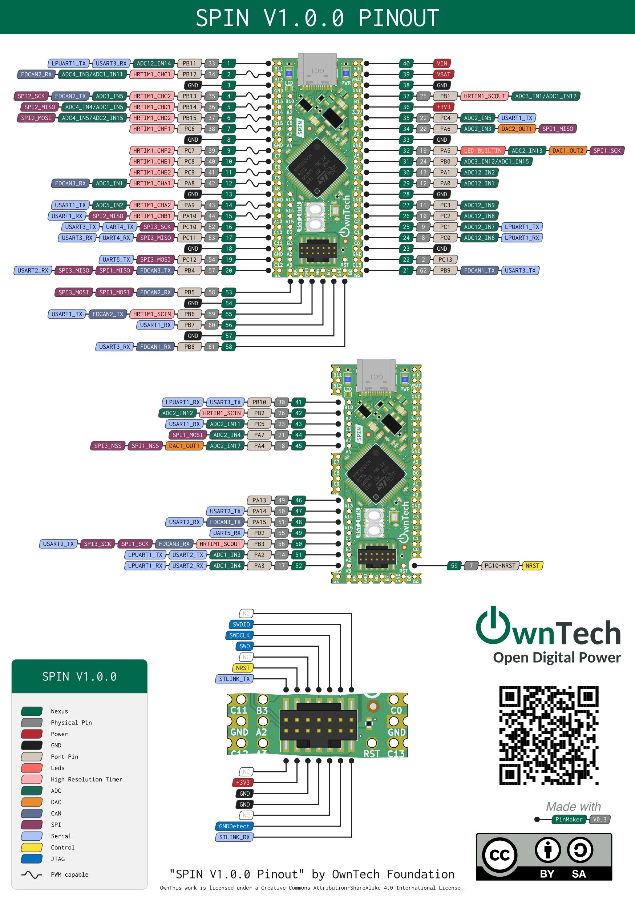
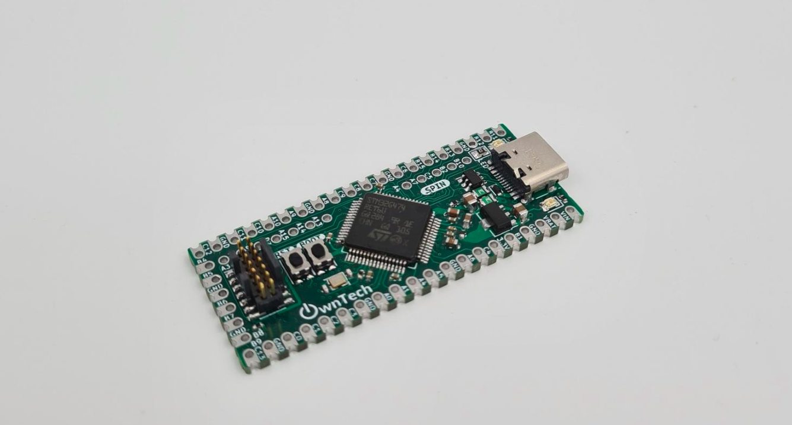

# SPIN

SPIN is a dev' board specialized for power applications. 
SPIN has it's dedicated firmware that is meant to be super intuitive and simple to use. 



## Simple to use

* Native USB support
* OwnPlot compatible! Graphical interface to monitor the application.
* Verbose mode available
* Debug friendly

## Fast and precise PWM

* 10 PWM signals ready to deploy!
* Up to 55MHz PWM frequency
* Up to 184ps temporal resolution
* Center-aligned modulation support
* Advanced phase shifting options
* Multiple SPIN synchronization support
* Dead-time support


## Seamless measurement acquisition

* 6 ADC channels 12 bits ready to go!
* 60kHz acquisition rate.
* Synchronized with the PWM generators to place the measurements in time accurately.
* Non-blocking acquisition system.

## Floating point unit support

* Fast intuitive computation
* Support of optimized math functions from ARM libraries

## Real-Time advanced control laws

* Configurable Control Frequency.
* Voltage Mode
* Peak Current mode

## IoT ready

* Ready for Over the Air (OTA) update
* Compatible with cloud-based monitoring




# License 

This project is under CERN-OHL-S open hardware Licence
Licence can be consulted inside of the Licence folder.

# Repository architecture 

The repository has the following organization 

* Datasheet 	Contains all the datasheet of main components and integrated circuits used in the design
* Images 	Contains the images of the Readme
* KiCAD_files	Contains the KiCad project, for this converter two separated .pro files contain the two different PCB that compose the power converter. 
* libs  
   * footprints.pretty Contains the project-specific footprints
      * footprints.3Dshapes contains the step files for project-specific 3D footprints. 
* License 	Contains the pdf file of the CERN-OHL-S open hardware license
* Logo 		Contains the .png images of the logo used for the title block
* Manufacturing_files
   * Definition_Package_MCUSPIN Contains the definition package for manufacturing
   
# Documentation 

All files are available in this centralized repository. 
Manufacturing files, including gerbers and BOM are placed in the Manufacturing files folder.
Editable design files are placed in KiCad Files folder. 

More documentation is available at [docs.owntech.org](http://docs.owntech.org/) 

# Contribute 

You are very welcome as a contributor! You can contribute by : 
- Opening issues if you find some 
- Propose enhancements and new features 
- Join our [Discord](https://discord.gg/KAM8ukUYF5) channel
- Submit Pull Request (Please get in touch first so that we can coordinate as GIT and hardware synergy is a bit tricky!)

# License 

This project is propelled by OwnTech Team under CERN-OHL-S open hardware Licence
The documentation provided is placed under Creative Commons SA-BY

# Disclaimer 

DISCLAIMER: This power converter is currently in alpha version (V1.2) and OwnTech team 
does not provide guarantees of any kind.


     * * * * * * * * * * * * * * * * * * * * * * * * * * * *
     *       _                                             *
     *    _ | | _                _______        _          *
     *   / || || \              |__   __|      | |         *
     *  / /`|_| \ \_        ___ __ | | ___  ___| |__       *
     * ( (`  ``  )\ \  /\  / | '_ \| |' _ `/ __| '_ `      *
     *  \ \ ___ / /\ \/  \/ /| |`| | | '__( (__| |`| |     *
     *   \_______/` \__/\__/`|_| |_|_ \___,\___|_| |_|     *
     *    ````````   ``` ```  ``  ```` ```` ``````  ``     *
     * D i g i t a l i z i n g  P o w e r  T o g e t h e r *
     * ``````````````````````````````````````````````````` *
     * * * * * * * * * * * * * * * * * * * * * * * * * * * *


